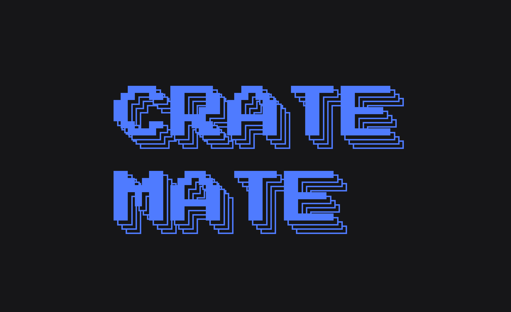

# CrateMate

<p align="center">
  
</p>

[](https://pypi.org/project/cratemate/)
[](LICENSE)
[](https://python.org)

A command-line tool that cleans up downloaded music files and organizes them into a DJ-ready library. Parses filenames, fetches cover art and genre metadata from Spotify and Discogs, optionally uses Gemini AI for intelligent tagging, and copies everything to your library with clean names and embedded tags.

**Your originals are never touched.** CrateMate only copies, never moves or deletes source files during import.

## Why this exists

I built this because I needed something specifically for electronic music and DJing. General-purpose taggers like beets and MusicBrainz Picard are great tools, but my workflow needed something more opinionated: for electronic music the correct metadata is almost always already in the filename, so I wanted a tool that trusts the filename first, fetches art and genre automatically, and gets out of the way.

CrateMate takes a messy downloads folder and turns it into a clean, tagged, cover-art-embedded library ready for Rekordbox, Traktor, or Serato with zero manual matching.

## Quick start

**Requirements:** Python 3.10+ and optionally [FFmpeg](https://ffmpeg.org/) (for FLAC conversion and bitrate analysis).

```bash
pip install cratemate
cratemate              # opens interactive menu with first-run setup wizard
```

Or install from source:

```bash
git clone https://github.com/zarrebarre/CrateMate.git
cd CrateMate
pip install .
cratemate
```

On first run, a setup wizard walks you through configuring your library path and API keys. Everything is stored in `~/.config/cratemate/`.

## What it does

For each music file in a source folder:

1. **Parses the filename** to extract artist, title, and mix info (Extended Mix, Remix, etc.)
2. **(Optional) Gemini AI fixing** - sends filenames to Gemini to handle names that regex can't parse
3. **Falls back to existing ID3/FLAC tags** if the filename is missing info
4. **Searches Spotify** for album cover art and genre
5. **Falls back to Discogs** if Spotify has no result
6. **Strips existing album art** (removes promo images, low-res junk)
7. **Copies** the file to `~/Music/DJ_Library/Artist - Title (Mix).ext`
8. **Writes clean tags** (artist, title, genre) and embeds high-quality cover art
9. **Shows import statistics** - files processed, art sources, genre breakdown, total size, duration

## Features

### Import pipeline
The core import flow: parse filenames, fetch metadata from Spotify/Discogs, copy to library with clean names and tags. Works with regex or Gemini AI for filename parsing.

### Fix missing covers
Re-scans the library and fetches album art for any files missing cover images. Uses the same Spotify/Discogs lookup.

### Fix tags from Spotify
Updates album, year, and genre tags from Spotify for existing library files. Never changes artist, title, or duration - only supplementary metadata.

### Remove duplicates
Finds duplicate tracks by comparing normalized artist/title. Keeps the highest-quality version (FLAC > MP3, higher bitrate > lower).

### Clean up source folder
Finds files in a source folder that already have a matching copy in the library and offers to delete them. Requires explicit typed confirmation.

### FLAC to MP3 conversion
Convert FLAC files to 320kbps CBR MP3 using FFmpeg. Available during import (`--mp3` flag) or as a batch operation on existing library files. Preserves all tags and cover art.

### Batch rename (Gemini AI)
Re-parses existing library filenames using Gemini AI and renames files with cleaner names. Updates artist/title tags to match. Undoable.

### AI genre tagging (Gemini AI)
Classifies tracks into ~30 curated electronic music genres using Gemini. Optionally reorganizes the library into genre subfolders. Processes in batches of 30. Undoable.

### Fake bitrate detection (experimental)
Spectral analysis to identify files that claim to be high-quality but were transcoded from lower bitrate sources. Uses FFT-based frequency cutoff detection with confidence scoring. Requires FFmpeg and numpy.

### Undo
Reverses the last destructive operation (batch rename, genre organize). Undo log stored at `~/.config/cratemate/undo_log.json`.

## Interactive menu

```
  Import
  1  Import folder
  2  Clean up source folder

  Library
  3  Fix missing covers
  4  Fix tags from Spotify
  5  Remove duplicates
  6  Convert FLACs to MP3
  7  Batch rename files (Gemini)

  AI & Analysis
  8  AI genre tagging (Gemini)
  9  Detect fake bitrates (experimental)

  u  Undo last    s  Settings    q  Quit
```

## CLI reference

```bash
# Import
cratemate ~/Downloads/music                    # import with regex parser
cratemate ~/Downloads/music --gemini           # import with Gemini AI
cratemate ~/Downloads/music --dry-run          # preview without copying
cratemate ~/Downloads/music --mp3              # convert FLACs to MP3 during import
cratemate --library ~/Music/MyLibrary          # custom library path

# Library maintenance
cratemate --fix-covers                         # fetch missing cover art
cratemate --fix-tags                           # update tags from Spotify
cratemate --remove-dupes                       # remove duplicate tracks
cratemate --clean-source ~/Downloads/music     # delete already-imported source files
cratemate --convert-flac                       # batch convert library FLACs to MP3
cratemate --batch-rename                       # re-parse and rename files via Gemini

# AI features
cratemate --ai-genres                          # tag genres via Gemini
cratemate --ai-genres --organize               # tag + move to genre folders

# Quality analysis
cratemate --detect-fakes                       # scan lossy files for fake bitrates
cratemate --detect-fakes --lossless            # also scan FLAC/WAV/AIFF

# Undo
cratemate --undo                               # reverse last operation

# All flags support --dry-run for preview
```

## Output format

Files are copied to the library with normalized names:

```
~/Music/DJ_Library/
    Mall Grab - You Thought (Original Mix).flac
    Peggy Gou - 1+1=11 (Spray Remix).mp3
    Sam Alfred - Suzuka (Extended).flac
```

Pattern: `Artist - Title (Mix Info).ext`

## Configuration

All config lives in `~/.config/cratemate/`:

| File | Purpose |
|------|---------|
| `config.json` | Library path and preferences |
| `.env` | API keys |
| `undo_log.json` | Last operation undo data |

On first run, a setup wizard walks through everything. Change settings anytime via the `s` menu option.

### API keys

All keys are optional - CrateMate degrades gracefully if any are missing.

| Key | Purpose | Get it |
|-----|---------|--------|
| `SPOTIFY_CLIENT_ID` / `SPOTIFY_CLIENT_SECRET` | Cover art + genre lookup | [Spotify Developer Dashboard](https://developer.spotify.com/dashboard) |
| `DISCOGS_USER_TOKEN` | Fallback cover art | [Discogs Developer Settings](https://www.discogs.com/settings/developers) |
| `GEMINI_API_KEY` | AI filename parsing, genre tagging | [Google AI Studio](https://aistudio.google.com/apikey) |

Copy `.env.example` to `~/.config/cratemate/.env` and fill in your keys, or use the built-in setup wizard.

## Dependencies

| Package | Purpose |
|---------|---------|
| [mediafile](https://pypi.org/project/mediafile/) | Read/write audio metadata (ID3, FLAC, Vorbis tags) |
| [requests](https://pypi.org/project/requests/) | HTTP client for Spotify, Discogs, and Gemini APIs |
| [Pillow](https://pypi.org/project/pillow/) | Resize album art before embedding |
| [python-dotenv](https://pypi.org/project/python-dotenv/) | Load API keys from `.env` files |

**Optional system dependencies:**

| Dependency | Purpose | Install |
|------------|---------|---------|
| FFmpeg | FLAC-to-MP3 conversion, bitrate detection | `brew install ffmpeg` / `apt install ffmpeg` |
| numpy | Spectral analysis for fake bitrate detection | `pip install numpy` |

## Project structure

```
cratemate.py        # All application logic (single file)
pyproject.toml      # Package metadata and dependencies
requirements.txt    # Dependency list for pip install -r
.env.example        # Template for API keys
LICENSE             # MIT license
```

## License

MIT

---

*Built with [Claude Code](https://claude.ai/code)*
